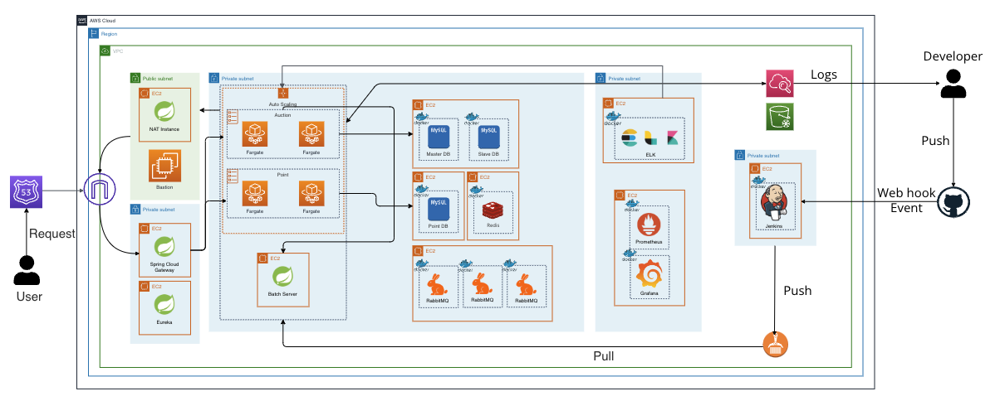
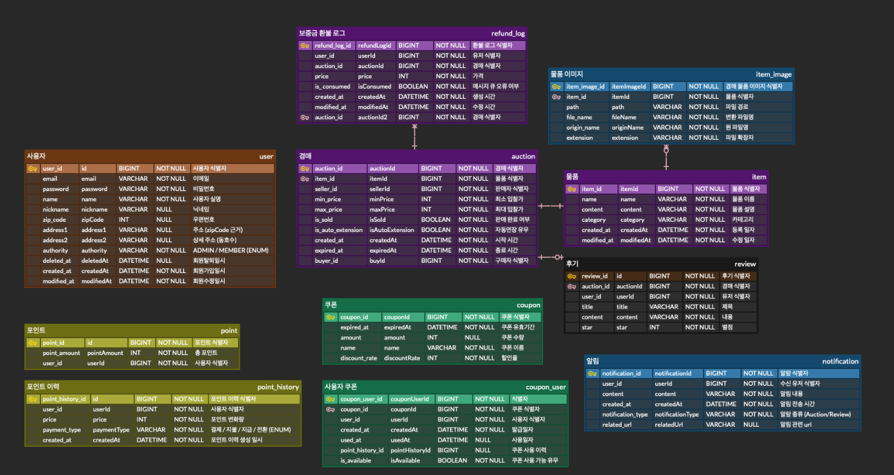
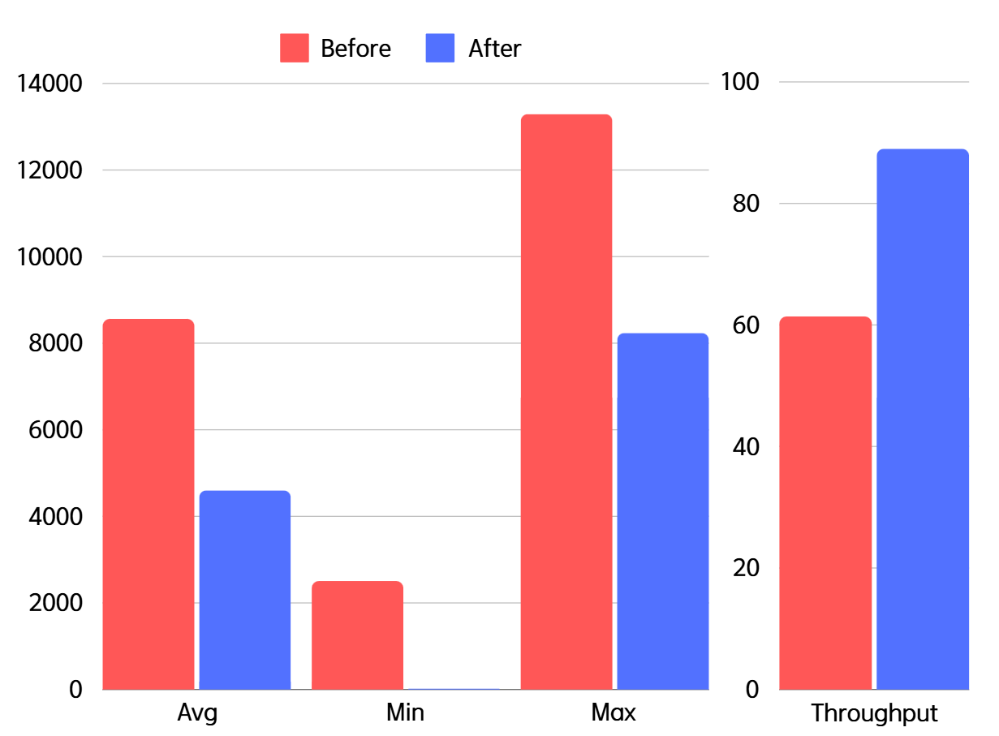
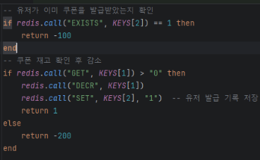
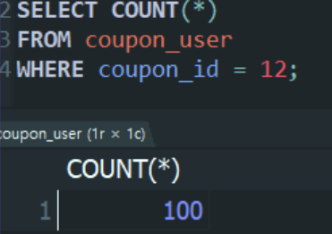
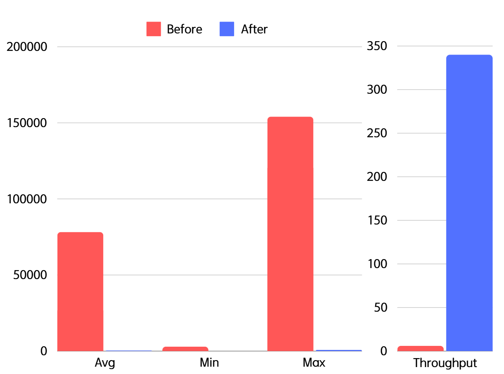

# 📦 중고 물품 실시간 경매 서비스

## 1. 프로젝트 개요
**개발 기간:** 2024.10.21 ~ 2024.11.22

`All In Auction` 은 사용자가 실시간으로 물품을 경매할 수 있는 Java Spring 기반의 중고 경매 사이트입니다. 사용자는 경매 등록, 입찰, 실시간 알림을 통해 다른 사용자와의 경쟁을 경험할 수 있으며, 대규모 트래픽에도 안정적인 입찰 및 쿠폰 발급이 가능하도록 설계되었습니다.

  
<strong>Team Notion</strong>

  
  <a href="https://teamsparta.notion.site/999-1232dc3ef51480e2a3adc7c23fdd3a40">팀 노션</a>

  
<strong>Team Notion</strong>

  
  <a href="https://all-in-auction.com">배포 URL</a>

### 서비스 플로우

1. **경매 물품 등록**  
   판매자가 경매에 `물품을 등록` 하여 시작 가격과 경매 만료 시간을 설정합니다.

2. **입찰자 입찰 생성**  
   입찰자는 관심 있는 경매 물품에 `입찰 금액을 입력` 하여 입찰을 시작합니다.

3. **최고 입찰자 갱신**  
   각 입찰 시 기존 최고 입찰 금액과 비교하여 더 높은 금액이 제시되면 해당 입찰자가 `최고 입찰자로 갱신` 됩니다.

4. **경매 종료 및 낙찰**  
   정해진 만료 시간이 지나면 경매가 종료되며, 최고 입찰자가 `최종 낙찰자로 확정` 됩니다.

  

 

### 아키텍처

  

### ERD

  

 

## 2. 주요 기술 스택

### **백엔드**

        

### **데이터베이스**

   

### **CI/CD**

  

### **클라우드 및 모니터링**

   

### **로그 관리**

  

### **협업 도구**

      

 

## 3. 팀 소개

  <table>
    <tbody>
      <tr>
        <td align="center" style="padding: 20px;">
          
          

            <b>팀장</b> 
            <a href="https://github.com/devmoonjs" style="font-size: 16px;">문정석</a>
            

              검색 경매 초기 인프라 구축 CQRS MSA 전환(gRPC)
            

          

        </td>
        <td align="center" style="padding: 20px;">
          
          

            <b>부팀장</b> 
            <a href="https://github.com/kim-na-ram" style="font-size: 16px;">김나람</a>
            

              경매 모니터링 시스템 쿠폰 만료 처리 배치 배치 서버 CI/CD MSA 전환(OpenFeign)
            

          

        </td>
        <td align="center" style="padding: 20px;">
          
          

            <b>팀원</b> 
            <a href="https://github.com/areum0116" style="font-size: 16px;">김아름</a>
            

              경매 알림 검색 환불 예외 보상 배치 Gateway, Eureka Circuit Breaker
            

          

        </td>
        <td align="center" style="padding: 20px;">
          
          

            <b>팀원</b> 
            <a href="https://github.com/inseooo0" style="font-size: 16px;">황인서</a>
            

              결제 쿠폰 경매 동시성 제어 Terraform CI/CD
            

          

        </td>
      </tr>
    </tbody>
  </table>

 

<h2>4. <a href="https://spectacled-plastic-a9d.notion.site/145df15aae15809cb1cad825e0a8364c?pvs=4">기술적 의사결정</a></h2>

## 5. 트러블 슈팅 & 최적화 전략

### 1-1. 입찰 기능 성능 향상 (CQRS 도입)

경매 입찰 로직에서 CQRS 패턴을 도입하여 경매 시스템의 **입찰 기능 성능**을 개선.

#### 📊 CQRS 도입 전후 성능 비교
시나리오 상황 : 유저 1000명이 동시에 경매 한 건을 입찰한다.
#### 도입 전 성능 테스트 결과

| 구분      | 표본 수 | 평균 (ms) | 최소값 (ms) | 최대값 (ms) | 표준편차 | 오류 % | 초당 요청 수 | 수신 KB/초 | 전송 KB/초 | 평균 바이트 수 |
|-----------|---------|-----------|-------------|-------------|----------|--------|--------------|------------|------------|---------------|
| HTTP 요청 | 1000    | 8561      | 2506        | 13292       | 3014.49  | 0.20%  | 61.4/sec     | 37.14      | 25.83      | 619.5         |
| **총계**  | **1000**| **8561**  | **2506**    | **13292**   | **3014.49**| **0.20%** | **61.4/sec** | **37.14**  | **25.83**  | **619.5**     |

#### 도입 후 성능 테스트 결과

| 구분      | 표본 수 | 평균 (ms) | 최소값 (ms) | 최대값 (ms) | 표준편차 | 오류 % | 초당 요청 수 | 수신 KB/초 | 전송 KB/초 | 평균 바이트 수 |
|-----------|---------|-----------|-------------|-------------|----------|--------|--------------|------------|------------|---------------|
| HTTP 요청 | 1000    | 4599      | 23          | 8235        | 2076.24  | 0.10%  | 89.0/sec     | 50.92      | 37.44      | 585.6         |
| **총계**  | **1000**| **4599**  | **23**      | **8235**    | **2076.24**| **0.10%** | **89.0/sec** | **50.92**  | **37.44**  | **585.6**     |

#### 💡 성능 개선 요약

- **평균 응답 시간** : 8561ms → 4599ms로 약 `46% 감소`
- **오류율** : 0.20% → 0.10%로 절반 감소
- **처리량 (Throughput)** : 61.4 요청/초 → 89.0 요청/초로 약 `45% 증가`

  

 

CQRS 패턴을 통해 **읽기 작업** 과 **쓰기 작업** 을 분리하여, 경매 서비스의 응답 속도와 처리 성능을 크게 개선했다다. 이를 통해 실시간 경매 환경에서 높은 성능과 안정성을 확보할 수 있었다.

 

### 1-2. 입찰 기능 성능 향상 (gRPC 도입)

- 기존 모놀리식 아키텍처에서 **MSA**로 전환하며 OpenFeign &rarr; **gRPC**로 변경해 입찰 기능 성능을 한 번 더 개선.   
- JSON &rarr; **Protobuf**를 통한 데이터 직렬화로 전송 속도를 향상.   

#### 📊 gRPC 도입 전후 성능 비교
시나리오 상황 : 유저 1000명이 동시에 경매 한 건을 입찰한다.
#### OpenFeign 성능 테스트 결과

| 구분      | 표본 수 | 평균 (ms) | 최소값 (ms) | 최대값 (ms) | 표준편차 | 오류 % | 초당 요청 수 | 수신 KB/초 | 전송 KB/초 | 평균 바이트 수 |
|-----------|---------|-----------|-------------|-------------|----------|--------|--------------|------------|------------|---------------|
| HTTP 요청 | 1000    | 8208      | 79          | 14911       | 3899.81  | 0.00%  | 56.3/sec     | 33.86      | 23.62      | 615.8         |
| **총계**  | **1000**| **8208**  | **79**    | **14911**   | **3899.81**| **0.00%** | **56.3/sec** | **33.86**  | **23.62**  | **615.8**     |

#### gRPC 성능 테스트 결과

| 구분      | 표본 수 | 평균 (ms) | 최소값 (ms) | 최대값 (ms) | 표준편차 | 오류 % | 초당 요청 수 | 수신 KB/초 | 전송 KB/초 | 평균 바이트 수 |
|-----------|---------|-----------|-------------|-------------|----------|--------|--------------|------------|------------|---------------|
| HTTP 요청 | 1000    | 4428      | 14          | 8169        | 2254.94  | 0.00%  | 89.5/sec     | 51.38      | 37.73      | 585.8         |
| **총계**  | **1000**| **4428**  | **14**      | **8169**    | **2254.94**| **0.00%** | **89.5/sec** | **51.38**  | **37.73**  | **585.8**     |

#### 💡 성능 개선 요약

- **평균 응답 시간** : 8208ms → 4428ms로 약 `45% 감소`
- **처리량 (Throughput)** : 56.3 요청/초 → 89.5 요청/초로 약 `59% 증가`

  

 

OpenFeign에서 gRPC로 전환하고 Protobuf 기반 데이터 직렬화를 적용해 요청 속도를 약 45% 개선하며 안정적인 경매 입찰 환경을 구현했다.

------

### 2. 쿠폰 발급 동시성 처리 (분산락 및 Lua 스크립트 적용)

- **Redisson** 을 사용하여 **분산락(Distributed Lock)** 을 구현해 다수의 사용자가 동시에 쿠폰 발급을 요청할 때 발생하는 동시성 문제를 해결하였다.
- **Lua 스크립트** 를 통해 Redis에 저장된 쿠폰 수량을 원자적으로 조회하고 업데이트하여 동시성을 관리했다.
- **쿠폰 발급** 과 같은 추가 작업은 Kafka를 통해 **비동기적으로 처리** 하여 성능을 최적화할 수 있었다.
- **도입 결과** : 여러 사용자가 동시에 쿠폰을 발급받으려 시도하더라도 동시성 제어에 성공하여, 정해진 수량만큼 정확하게 쿠폰이 발급됨을 확인할 수 있었다.

  
  

-------

### 3. 만료된 쿠폰 처리 (스프링 배치)

#### 💡 개선 결과 요약  

- **성능 개선** : 기존 1시간 47분 소요 -> 21분으로 단축
- **효율성 증가** : 처리 속도 `5.11배 향상`, 실행 시간 `80.43% 단축`

#### 문제점

- Reader에서 모든 컬럼을 조회하며 불필요한 데이터가 **과다 조회**되는 현상이 발생했다.
- JPAItemWriter의 **Dirty Checking**으로 단 건 처리가 발생하며 Database와 빈번한 통신으로 인한 성능 저하가 발생했다.

#### 해결 방안

**3-1. Writer 변경**
  - `JPAItemWriter`에서 `JDBCBatchItemWriter`로 변경
  - Chunk Size만큼 데이터를 모아 DB로 한 번에 전달해 **통신 횟수 감소**

**3-2. Projection 적용**
  - Reader에서 필요한 컬럼만 조회하도록 **쿼리 최적화**

 

**[Before]**   

**[After]**   
   

  

------

### 4. MSA 전환 후 장애 대응 및 오류 전파 방지 (Circuit Breaker 사용)

#### 문제점

- MSA 환경 전환으로 인해 서비스 간 의존성이 증가하였다.
- 장애 발생 시 오류 전파로 인해 다른 서비스까지 **연쇄 장애**가 발생할 가능성이 있다.

#### 해결 방안

4-1. **Resilience4J**를 활용해 서비스 연쇄 장애 방지 및 MSA 환경에서의 안정적인 서비스 구축   
4-2. 임계치 초과 시 **호출을 차단(OPEN)** 하고, 문제가 있는 서비스로의 추가 요청 차단    
4-3. **Fallback 메서드**를 통한 서비스 대체 동작 구현 및 서비스의 완전한 장애 방지   

 

**[Before]**    
    

**[After]**   
   

------

### 5. 검색 성능 향상 (Elasticsearch 도입)

#### 💡 성능 개선 요약  

- **평균 응답 시간** : 78241ms → 403ms로 약 `98% 감소`
- **처리량 (Throughput)** : 6.4 요청/초 → 340.8 요청/초로 약 `53배 개선`

#### 문제점

- 상품 검색 시 평균 2분 37초라는 굉장히 긴 시간이 소요되었다.
- 인덱싱 적용에도 불구하고 `LIKE %___%`를 사용하는 방식으로 인해 **Full Table Scan**이 발생하며 성능이 개선되지 않았다.
- 검색어와 완전히 일치하지 않으면 결과를 반환하지 못했다.

#### 해결 방안

**5-1. Elasticsearch 도입**  
  역 인덱스(Inverted Index) 구조를 활용해 검색 속도를 대폭 향상

**5-2. Nori Analyzer 사용**   
  한국어 형태소 분석기를 도입해 검색어를 형태소 단위로 분해하고 불용어를 제거해 정확한 검색 결과를 제공

**5-3. 가중치 및 Fuzziness 설정**   
  검색어와 가장 관련성 높은 결과가 우선 출력되도록 필드별 가중치를 설정하고 오타나 부분 일치 검색이 가능하도록 Fuzziness를 활성화

**5-4. 인덱스 설계 최적화**   
  도메인의 데이터 구조에 따라 필드 타입을 지정하고 매핑을 최적화해 효율적인 데이터 검색을 구현

#### 📊 ES 도입 전후 성능 비교
시나리오 상황 : 유저 1000명이 300만 건의 상품을 검색한다.
#### 도입 전 성능 테스트 결과

| 구분      | 표본 수 | 평균 (ms) | 최소값 (ms) | 최대값 (ms) | 표준편차 | 오류 % | 초당 요청 수 | 수신 KB/초 | 전송 KB/초 | 평균 바이트 수 |
|-----------|---------|-----------|-------------|-------------|----------|--------|--------------|------------|------------|---------------|
| HTTP 요청 | 1000    | 78241      | 2933       | 154075      | 43697.74  | 10.20%  | 6.4/sec    | 15.82      | 2.52       | 2544.0         |
| **총계**  | **1000**| **78241**  | **2933**   | **154075**  | **43697.74**| **10.20%** | **6.4/sec** | **15.82**  | **2.52**  | **2544.0** |

#### 도입 후 성능 테스트 결과

| 구분      | 표본 수 | 평균 (ms) | 최소값 (ms) | 최대값 (ms) | 표준편차 | 오류 % | 초당 요청 수 | 수신 KB/초 | 전송 KB/초 | 평균 바이트 수 |
|-----------|---------|-----------|-------------|-------------|----------|--------|--------------|------------|------------|---------------|
| HTTP 요청 | 1000    | 403       | 6           | 799         | 248.18   | 0.00%  | 340.8/sec    | 743.57     | 137.49     | 2234.0        |
| **총계**  | **1000**| **403**   | **6**       | **799**    | **248.18**| **0.00%** | **340.8/sec** | **743.57**  | **137.49**  | **2234.0**  |

  

------

### 6. 보증금 환불 시 카프카 예외 처리

#### 6-1. 트랜잭션 롤백 처리로 데이터 일관성 확보
- Kafka 프로듀서에 `Transactional ID`를 부여, 메시지 발송과 서비스 단의 데이터베이스 트랜잭션을 **하나의 작업 단위**로 묶음.
- 이를 통해 데이터 손실 및 중복 처리 방지 가능. 메시지의 Exactly Once 전송 보장.

#### 6-2. ACKS_CONFIG 설정으로 메시지 저장 신뢰성 강화
- `acks=all` 옵션을 활성화하여 모든 replication의 broker가 메시지를 정상적으로 저장했음을 확인한 후에만 메시지가 처리되도록 설정.
- 이를 통해 메시지 손실 가능성을 줄이고 **강한 내구성(durability)** 보장.

#### 6-3. CustomErrorHandler와 DLT(Dead Letter Topic) 도입
- 예외로 인한 소비 실패 메시지들의 누락 방지를 위해 **Custom ErrorHandler** 구현, 예외 상황 세부적으로 관리.
- 실패한 메시지를 별도의 **Dead Letter Topic(DLT)** 에 저장하도록 구성하여 이후 관리자나 별도 프로세스를 통해 **문제 추적 및 재처리** 가능하도록 설정.

#### 6-4. 예외 발생 시 관리자 Slack 알림 전송
- **실시간 문제 모니터링**과 **안정성 유지**를 위해 Slack API 연동, 예외 케이스 발생 시 관리자 채널로 알림 발송하도록 설정.

#### 6-5. 적절한 파티션 수 설정으로 처리량 최적화
- Kafka Topic의 파티션 개수를 입찰 요청량과 소비자의 처리 속도에 맞춰 적절히 설정.
- Consumer 인스턴스와 병렬 처리를 고려하여 계산, 이를 통해 **로드 밸런싱**을 극대화하고 메시지 처리 지연을 최소화.

